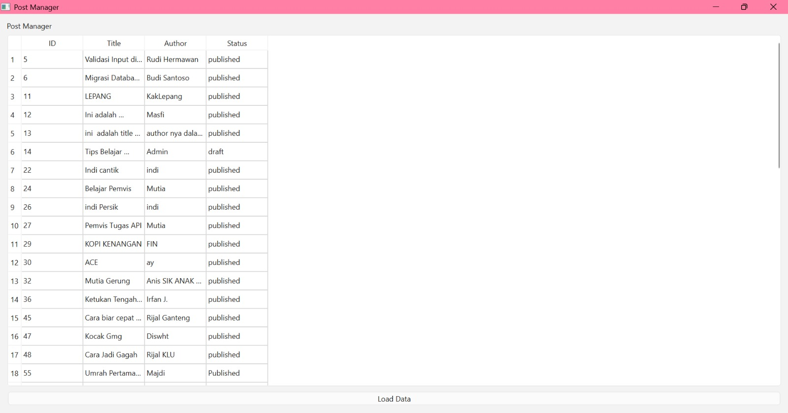

# T6 Week 11 - Post Manager

## Deskripsi
Aplikasi ini dibuat menggunakan Python dan PySide6 untuk mengelola data post dari REST API. Program ini menampilkan data dalam bentuk tabel dan menyediakan fitur CRUD (Create, Read, Update, Delete).

## Fitur
- Menampilkan daftar post (GET)
- Menampilkan detail post beserta komentar
- Menambah data post (POST)
- Mengedit data post (PUT)
- Menghapus data post (DELETE)
- Menggunakan threading agar UI tidak freeze
- Menampilkan status loading dan selesai

## Teknologi
- Python
- PySide6 (GUI)
- Requests (HTTP Client)

## Screenshot

### Load Data

### Tambah Data

### Detail Post

### Detail Post dengan Komentar

### Edit Data

### Hapus Data

### State Loading

### State Selesai

## Cara Menjalankan
1. Aktifkan virtual environment: